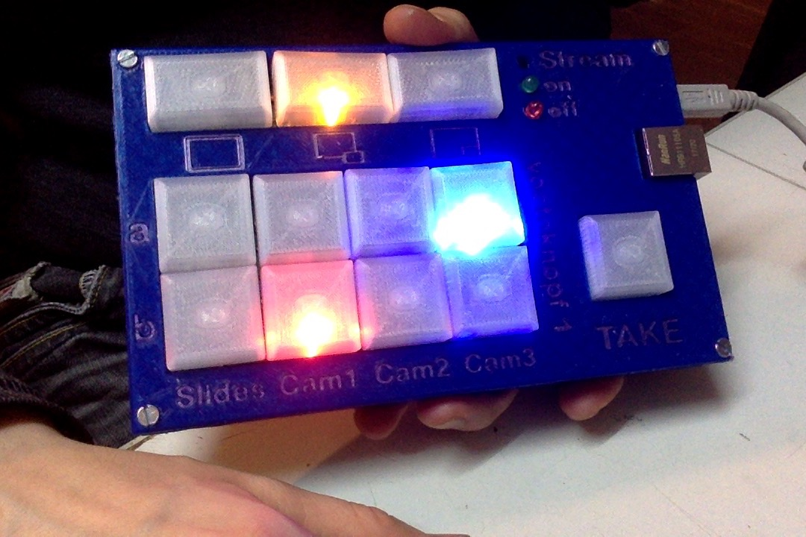

This is a hardware-interface vor [voctomix](https://github.com/voc/voctomix/tree/master/voctocore), developed late 2017 and tried in a few talks at 34c3.

Key features are:

* Custom PCB
* Cherry MX switches with custom 3D-printed keycaps
* 3D-printed top and bottom enclosure parts “sandwiched” around the PCB
* Arduino Nano which sends commands to a computer via USB
* Computer relays the commands to the voctomix software via [socat](https://linux.die.net/man/1/socat)
* is supposed to learn to speak TPC on its own (was not implemented on 34c3)

This is a community project with help from many friends.

The **keycaps** are [gothic.FCStd](https://github.com/benjaminwand/Cherry-MX-keycaps/tree/master/with%20LED), 20 * 33,5 mm for the composite mode buttons and 25 * 25 mm for the camera/channel buttons and the take button. Please adjust the side lengths in the spreadsheet of the file, but there are also stl files in the ‘case’ folder.

### Lessons learnt after PCB production V 1.0: 
* slightly wrong footprint for resistors, too short
* wrong footprint for cherry switches, contacts for LEDs are too far apart
* the Cherry MX I got from reichelt.de aren’t for PCB mount, be more careful when shopping
* wrong footprint for StreamOn switch, fix: bend up two diagonal contacts
* 1.5k ohm pull-up-resistors are required between A4 and 5V and A5 and 5V
* the buttons would look more evenly illuminated if the LED was behind the switches -> turn the Cherry MX around 180°

See [here](graphics/bugfixes.jpg) for a photo with hardware fixes.

### Lessons learnt regarding the case
* I’ve actually included small changes into the file after printing, print as-is, and slice everything the way around it is supposed to end up. Yes, printing the buttons upside down would be faster but looks ugly. I found it easier to remove the support-material when the buttons were printed with raft.
* Print everything with transparent filament and then paint up the upper side of the case (except from the letters !!!) with a dark-ish pen that isn’t water-soluble. Due to the LEDs inside, the letters become illuminated.

### Shopping list
* 1 arduino nano (clone)
* 1 ethernet-shield for arduino nano
* 12 Cherry MX switches with holes for LEDs, for PCB mount. I used ‘clear’ and would go for ‘brown’ next time.
* 12 3mm LEDs, 4 red, 4 blue, 4 other color (yellow). alternatively there are probably special LEDs für Cherry MX but I didn’t have the time for searching
* 1 tact switch for StreamOn-button 
* 1 5mm LED red
* 1 5mm LED green
* 14 resistors 220
* 13 resistors 10k
* 2 resistors 1.5k
* 4 nuts and bolts M3 (best: screws with countersunk head)

### Status
One device has been built so far and has been successfully used in a few talks on the 34th Chaos Communication Congress.

### References
* [Cherry MX keycaps](https://github.com/benjaminwand/Cherry-MX-keycaps)
* [Geekend Prototype](https://github.com/benjaminwand/voctoknopf-Geekend-prototype)
* [Voctoknopf as a handheld controller](https://github.com/benjaminwand/voctoplay)